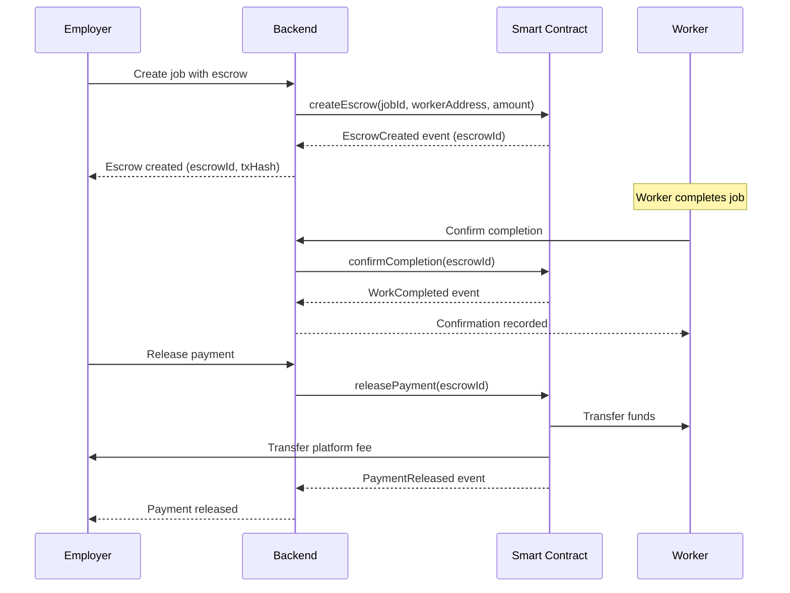
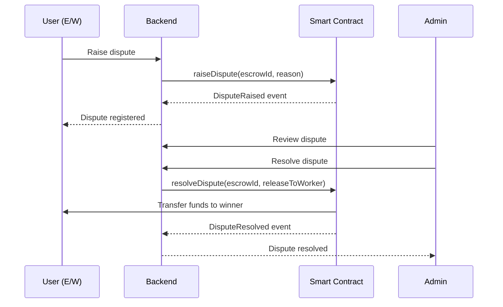

# Blockchain Integration Guide

## Overview

RozgaarHub integrates blockchain technology for secure, transparent payment escrow between employers and workers. This guide explains how the blockchain integration works and how to use it.

## Architecture

```
┌─────────────┐         ┌──────────────┐         ┌─────────────────┐
│   Frontend  │────────▶│   Backend    │────────▶│   Blockchain    │
│   (React)   │         │  (Express)   │         │   (Hardhat)     │
└─────────────┘         └──────────────┘         └─────────────────┘
                              │                          │
                              ▼                          ▼
                        ┌──────────┐            ┌────────────────┐
                        │ MongoDB  │            │ Smart Contracts│
                        └──────────┘            └────────────────┘
```

## Smart Contracts

### 1. RozgaarEscrow.sol
Handles secure payment escrow for jobs.

**Key Features:**
- Escrow creation with automatic fee calculation (2.5%)
- Worker confirmation of job completion
- Employer payment release
- Dispute mechanism
- Emergency refund after timeout

**Contract Address:** Set in `.env` as `ESCROW_CONTRACT_ADDRESS`

### 2. UserRegistry.sol
Stores user profiles and reputation on-chain.

**Key Features:**
- User registration with wallet linking
- Reputation score tracking
- Verification badges
- Profile hash storage (IPFS)

**Contract Address:** Set in `.env` as `USER_REGISTRY_CONTRACT_ADDRESS`

---

## Payment Flow

### Standard Flow (No Disputes)



### Dispute Flow



---

## Setup Instructions

### 1. Deploy Smart Contracts

```bash
cd blockchain

# Start local Hardhat node
npm run node

# In another terminal, deploy contracts
npm run deploy:local

# Copy contract addresses to backend .env
```

### 2. Configure Backend

Update `backend/.env`:
```env
# Blockchain Configuration
BLOCKCHAIN_NETWORK=localhost
RPC_URL=http://127.0.0.1:8545
ESCROW_CONTRACT_ADDRESS=0x5FbDB2315678afecb367f032d93F642f64180aa3
USER_REGISTRY_CONTRACT_ADDRESS=0xe7f1725E7734CE288F8367e1Bb143E90bb3F0512
PLATFORM_WALLET_PRIVATE_KEY=0xac0974bec39a17e36ba4a6b4d238ff944bacb478cbed5efcae784d7bf4f2ff80
CHAIN_ID=1337
```

### 3. Initialize Blockchain Service

The blockchain service initializes automatically when the backend starts. Check status:

```bash
curl http://localhost:4000/api/blockchain/status
```

---

## Usage Examples

### 1. Register User on Blockchain

**Frontend:**
```javascript
// User needs to provide their private key
const response = await fetch('/api/blockchain/user/register', {
  method: 'POST',
  headers: {
    'Authorization': `Bearer ${token}`,
    'Content-Type': 'application/json'
  },
  body: JSON.stringify({
    privateKey: userPrivateKey,
    profileHash: '' // Optional IPFS hash
  })
});

const data = await response.json();
console.log('Wallet Address:', data.walletAddress);
```

### 2. Create Job with Escrow

**Frontend:**
```javascript
const response = await fetch('/api/blockchain/escrow/create', {
  method: 'POST',
  headers: {
    'Authorization': `Bearer ${employerToken}`,
    'Content-Type': 'application/json'
  },
  body: JSON.stringify({
    jobId: '65abc123...',
    workerId: '65def456...',
    amount: '0.1' // 0.1 ETH
  })
});

const data = await response.json();
console.log('Escrow ID:', data.escrowId);
console.log('Transaction Hash:', data.transactionHash);
```

### 3. Worker Confirms Completion

**Frontend:**
```javascript
const response = await fetch(`/api/blockchain/escrow/${escrowId}/confirm`, {
  method: 'POST',
  headers: {
    'Authorization': `Bearer ${workerToken}`,
    'Content-Type': 'application/json'
  },
  body: JSON.stringify({
    privateKey: workerPrivateKey
  })
});
```

### 4. Employer Releases Payment

**Frontend:**
```javascript
const response = await fetch(`/api/blockchain/escrow/${escrowId}/release`, {
  method: 'POST',
  headers: {
    'Authorization': `Bearer ${employerToken}`,
    'Content-Type': 'application/json'
  }
});
```

---

## Database Schema

### Payment Model (with Blockchain Fields)

```javascript
{
  jobId: ObjectId,
  workerId: ObjectId,
  employerId: ObjectId,
  amount: Number,
  status: 'pending' | 'paid' | 'overdue',
  
  // Blockchain fields
  useBlockchain: Boolean,
  escrowId: Number,
  blockchainTxHash: String,
  blockchainStatus: 'none' | 'created' | 'funded' | 'completed' | 'released' | 'disputed' | 'refunded'
}
```

### Job Model (with Blockchain Fields)

```javascript
{
  title: String,
  description: String,
  // ... other fields
  
  // Blockchain fields
  useBlockchain: Boolean,
  escrowId: Number
}
```

---

## Error Handling

### Common Blockchain Errors

1. **Blockchain service not available**
   ```json
   {
     "success": false,
     "message": "Blockchain service not available"
   }
   ```
   - Check if contracts are deployed
   - Verify RPC_URL is correct
   - Ensure Hardhat node is running

2. **Invalid wallet address**
   ```json
   {
     "success": false,
     "message": "Invalid worker wallet address"
   }
   ```
   - Worker must register on blockchain first
   - Verify wallet address format

3. **Transaction failed**
   ```json
   {
     "success": false,
     "message": "Blockchain transaction failed: insufficient funds"
   }
   ```
   - Check wallet balance
   - Verify gas price settings
   - Check network congestion

4. **Contract revert**
   ```json
   {
     "success": false,
     "message": "Blockchain escrow creation failed: Escrow already exists for this job"
   }
   ```
   - Check contract state
   - Verify escrow doesn't already exist
   - Review contract requirements

---

## Security Considerations

### Private Key Management

⚠️ **CRITICAL**: Never store private keys in the database or logs!

**Best Practices:**
1. Users should manage their own private keys
2. Use MetaMask or similar wallet for signing
3. Backend only stores wallet addresses, not private keys
4. Platform wallet private key should be in secure environment variables

### Transaction Signing

For production, implement client-side transaction signing:

```javascript
// Frontend with ethers.js
import { ethers } from 'ethers';

// Connect to user's wallet (MetaMask)
const provider = new ethers.BrowserProvider(window.ethereum);
const signer = await provider.getSigner();

// Sign transaction client-side
const contract = new ethers.Contract(contractAddress, abi, signer);
const tx = await contract.confirmCompletion(escrowId);
await tx.wait();

// Send transaction hash to backend for record-keeping
await fetch('/api/blockchain/escrow/sync', {
  method: 'POST',
  body: JSON.stringify({ escrowId, txHash: tx.hash })
});
```

---

## Testing

### Local Testing

1. Start Hardhat node:
```bash
cd blockchain
npm run node
```

2. Deploy contracts:
```bash
npm run deploy:local
```

3. Run backend tests:
```bash
cd backend
npm test
```

### Test Accounts

Hardhat provides test accounts with ETH:
```
Account #0: 0xf39Fd6e51aad88F6F4ce6aB8827279cffFb92266 (10000 ETH)
Private Key: 0xac0974bec39a17e36ba4a6b4d238ff944bacb478cbed5efcae784d7bf4f2ff80

Account #1: 0x70997970C51812dc3A010C7d01b50e0d17dc79C8 (10000 ETH)
Private Key: 0x59c6995e998f97a5a0044966f0945389dc9e86dae88c7a8412f4603b6b78690d
```

---

## Production Deployment

### 1. Deploy to Testnet (Polygon Mumbai)

```bash
cd blockchain
npm run deploy:mumbai
```

### 2. Update Environment Variables

```env
BLOCKCHAIN_NETWORK=mumbai
RPC_URL=https://rpc-mumbai.maticvigil.com
ESCROW_CONTRACT_ADDRESS=<deployed_address>
USER_REGISTRY_CONTRACT_ADDRESS=<deployed_address>
PLATFORM_WALLET_PRIVATE_KEY=<secure_key>
CHAIN_ID=80001
```

### 3. Verify Contracts

```bash
npx hardhat verify --network mumbai <CONTRACT_ADDRESS>
```

---

## Monitoring

### Event Listening

The blockchain service automatically listens to contract events:

```javascript
// In blockchainService.js
blockchainService.listenToEscrowEvents((eventName, data) => {
  console.log(`Event: ${eventName}`, data);
  
  // Update database based on events
  if (eventName === 'PaymentReleased') {
    updatePaymentStatus(data.escrowId, 'released');
  }
});
```

### Transaction Tracking

All blockchain transactions are logged with:
- Transaction hash
- Block number
- Gas used
- Timestamp

Check logs:
```bash
tail -f backend/logs/combined.log | grep "blockchain"
```

---

## Gas Optimization

### Current Gas Costs (Estimated)

- Create Escrow: ~150,000 gas
- Confirm Completion: ~50,000 gas
- Release Payment: ~80,000 gas
- Raise Dispute: ~60,000 gas

### Optimization Tips

1. **Batch Operations**: Create multiple escrows in one transaction
2. **Use Events**: Emit events instead of storing data on-chain
3. **Optimize Storage**: Use bytes32 instead of strings
4. **Layer 2**: Consider Polygon for lower fees

---

## Troubleshooting

### Issue: Blockchain service not initializing

**Check:**
1. RPC URL is correct and accessible
2. Contracts are deployed
3. Contract addresses in .env are correct
4. Network is running (Hardhat node for local)

### Issue: Transaction always fails

**Check:**
1. Wallet has sufficient balance
2. Gas price is set correctly
3. Contract state allows the operation
4. User has correct permissions

### Issue: Events not being captured

**Check:**
1. Event listener is set up correctly
2. Contract ABI is up to date
3. Network connection is stable
4. Logs are being written to file

---

## Future Enhancements

1. **Multi-signature Escrow**: Require multiple approvals
2. **Milestone Payments**: Release funds in stages
3. **Token Payments**: Support ERC-20 tokens
4. **Decentralized Dispute Resolution**: Integrate Kleros
5. **Layer 2 Scaling**: Deploy on Polygon zkEVM
6. **IPFS Integration**: Store job details on IPFS
7. **DAO Governance**: Community-driven platform decisions

---

## Support

For blockchain-related issues:
1. Check logs: `backend/logs/combined.log`
2. Verify contract state on block explorer
3. Test on local network first
4. Contact development team

---

**Last Updated:** 2024-01-15
**Version:** 1.0.0
